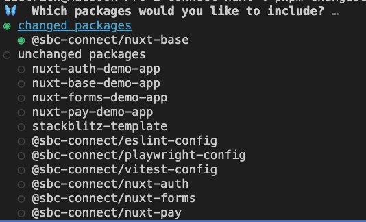

# A Guide to the Changesets Workflow

This guide provides a step-by-step walkthrough of the versioning and release process used in this monorepo. We use **Changesets** to automate version bumps and changelog generation, ensuring our releases are consistent and well-documented.

Following this process is a **required** step for any pull request that contains a code change affecting a versioned package.

<!-- omit in toc -->
## Table of Contents

- [What is a Changeset?](#what-is-a-changeset)
- [The Step-by-Step Workflow](#the-step-by-step-workflow)
- [Managing Beta Releases](#managing-beta-releases)

## What is a Changeset?
A changeset is a small markdown file that describes an "intent to release." It captures three key pieces of information:

1. Which packages have been changed.
2. How they should be versioned (major, minor, or patch).
3. A summary of the changes for the changelog.

These files are committed alongside your code, and our CI/CD pipeline uses them to automate the entire release process.

## The Step-by-Step Workflow
This is the process you will follow for every feature or bug fix that requires a release.

### Step 1: Make Your Code Changes
Work on your feature branch as you normally would, making commits as needed.

### Step 2: Add a Changeset
Once you have finished your code changes and are ready to commit, you need to add a changeset.

1. From the **root** of the monorepo, run the following command:
```bash
pnpm changeset
```

2. **Select Affected Packages:** The CLI will prompt you to select which packages your changes affect.

  

  - Use the arrow keys to navigate the list.
  - Press the spacebar to select a package.
  - You can select multiple packages if your change affects more than one.
  - It is not necessary to select linked packages, Changesets will automatically update and version linked packages.
  - Once you've selected all the affected packages, press Enter.

3. **Set the Version Bump:** The CLI will now ask you to specify the version bump for each selected package. It will cycle through `major` and `minor` bumps first.

  

  - Press the **spacebar** to select a bump type for a package.
  - Press **Enter** to skip and move to the next question.
  - **Important:** If you do not select a major or minor bump for a package, it will automatically be assigned a patch bump.
  - `patch`: For backward-compatible bug fixes.
  - `minor`: For new features that are backward-compatible.
  - `major`: For any changes that are not backward-compatible (breaking changes).

4. **Write the Summary:** The CLI will ask you to write a summary of the change. This is the most important step.

  

  - **This text will appear directly in the CHANGELOG.md file.**
  - Write your summary using [Conventional Commits](https://www.conventionalcommits.org/en/v1.0.0/#summary), e.g., `fix`, `feat`, `chore`, etc.
  - Write in the past tense (e.g., "Fixed a bug..." or "Added a new feature...").
  - Be clear and concise.
  - Reference any relevant issue or ticket numbers (e.g., `Fixes bcgov/entity#42`). GitHub will automatically link these in the final release notes.
  - If you need to write a multi-line summary, just press Enter without typing anything to open your default command-line editor.

5. **Submit Changeset:**

  

  - Finally, press `y` to submit the changeset.

### Step 3: Commit and Push
After you complete the prompts, a new markdown file will be created in the .changeset/ directory (e.g., .changeset/new-pugs-stand.md).

You must commit this file along with your code changes.

### Step 4: The Automation Takes Over
Once your pull request is reviewed and merged into main, the rest of the process is fully automated:

  

  1. The Changesets GitHub Action detects the new changeset file on main.
  2. It automatically opens a new pull request titled "update versions". This PR will contain the updated version numbers in the package.json files and the new entries in the CHANGELOG.md.
  3. After the "update versions" PR is reviewed and merged, the action will automatically publish the new package versions to the npm registry and create a corresponding GitHub Release.

By following this process, you ensure that every change is properly versioned and documented, leading to a clean and predictable release workflow.

## Managing Beta Releases

For larger features or breaking changes, it's often a good idea to publish beta or rc (Release Candidate) versions for testing before a final release. This is managed using Changesets' **pre-release mode**.

This workflow should be done on a development branch (e.g., develop or next).

### Entering Pre-Release Mode
On your development branch, run the following command. The beta part is a "tag" that will be part of the version number.

``` bash
pnpm changeset pre enter beta
```

This creates a `pre.json` file in the `.changeset` directory. Commit this file to your branch to officially put it in pre-release mode.

### Publishing Beta Versions
With the branch in pre-release mode, the CI/CD pipeline (the one that runs on pushes to develop) will now automatically publish beta versions. For example, a patch change will bump v1.2.0 to v1.2.1-beta.0. These versions are published to a specific beta tag on npm, so they won't be installed by default.

### Exiting Pre-Release Mode
When you are ready to create the final, stable release:

1. On the develop branch, run the exit command. This removes the pre.json file and updates the package.json files to their final, stable versions (e.g., from 1.2.1-beta.4 to 1.2.1).
```bash
pnpm changeset pre exit
```
2. Commit this change.
3. You can now create a pull request to merge develop into main. This PR will contain all the new features and the final version numbers, ready for the standard release process.